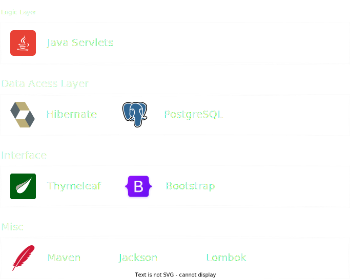
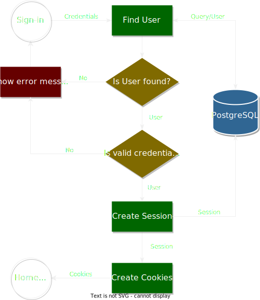
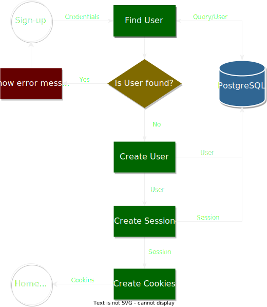

# Weather Tracker

Created according to the technical specifications presented
in [this course](https://zhukovsd.github.io/java-backend-learning-course/Projects/WeatherViewer/)

## Overview

A web application for viewing current weather. The user can register and add one or multiple locations (cities, villages, or other places) to their collection. Afterward, the main page of the application will display a list of user places with their current weather.

## Table of Content

1. [Application Features](#1-application-features)  
    1.1 [User related](#11-user-related)  
    1.2 [Location related](#12-locations-related)
2. [Application architecture](#2-application-architecture)  
    2.1 [Technologies / tools used](#21-technologies--tools-used)  
    2.2 [Data Model](#22-data-model)  
        2.2.1 [Relationships](#221-relationships)  
    2.3 [Design patterns](#23-design-patterns)  
    2.4 [Sessions & Cookies](#24-sessions--cookies)  
    2.5 [Interface overview](#25-interface-overview)  
        2.5.1 [More detailed view with interface elements](#251-more-detailed-view-with-interface-elements)
3. [Implementation details](#3-implementation-details)  
    3.1 [Sign in](#31-sign-in)  
    3.2 [Sign up](#32-sign-up)  
    3.3 [Sign out](#33-sign-out)  
    3.4 [Search](#34-search)  
    3.5 [Add](#35-add)  
    3.6 [View](#36-view)  
    3.7 [Delete](#37-delete)  

## 1. Application Features

This section shows the overall structure of the app features.  
For more details see - [implementation details](#3-implementation-details)

### 1.1 User related

> Classic authorization

- Sign in
- Sign up
- Sign out

### 1.2 Locations related

> Classic CRUD

- **Search** a location to track the weather
- **Add** a location to the tracked list
- **View** a list of locations with weather for each location
- **Delete** a location from the tracked list

## 2. Application architecture

This section shows the overall structure of the app and tries to clarify any unclear or questionable aspects.

### 2.1 Technologies / tools used

---

### 2.2 Data Model

The application have three main entities - User, Session and Location.

#### **2.2.1 Relationships**

One user can have 0 or more different sessions, therefore relationship between `users` and `sessions` is one-to-many (optional)

One user can have 0 or more locations in their list, same with location and their user list. Relationship between `users` and `locations` is many-to-many. Junction table locations_users have been created in order to implement this relationship.  
> **Note**  
> Note that relationship between `users` and junction table is one-to-many and optional. This is because a user can use the app without adding any location to their list, whereas a location entry cannot be created in the database without a user request.

---

### 2.3 Design patterns

Application uses [MVC](https://en.wikipedia.org/wiki/Model%E2%80%93view%E2%80%93controller) pattern.

The servlets act as **Controllers**. They handles user's requests and perform buisness logic.

The application contains **Model** classes which represents entities from database. [DAO](https://en.wikipedia.org/wiki/Data_access_object) objects are used to retrieve and persist data in the database.

The **View** layer of the application is managed by the Thymeleaf. HTML templates are used to dynamically generate the user interface.

---

### 2.4 Sessions & Cookies

The application does not use Java servlet session objects, instead it creates a custom session objects. The reason for this is to learn how to work with the sessions manually. The Spring handles the sessions automaticaly out of the box which is great, but not for the learning process.

After creating the session object is stored in the database. Id of this session object is stored inside the cookie which is transfered to the client. This allows the client to access their session on subsequent requests, as the server can retrieve the session object from the cookie.

---

### 2.5 Interface overview

The application have 4 available to user pages

- Home page
- Search page
- Sign in page
- Sign up page

They have the following relationships

From the home page user can access any other page.

From the search only available option is home page. The application will not allow user to search locations if thiey are not authorized.

The sign in and sign up pages have links to each other, but to the home page yet.

#### **2.5.1 More detailed view with interface elements**

Actually, the home and the search pages almost identical, and the same can be said about the sign in and sign up pages, but each page serves it's own purpose.

## 3. Implementation details

This section contains diagrams and descriptions for every feature of the app.

The diagrams are intented to be descriptive, short, clear and easy to understand. As a result, some details are omitted for brevity, but they can be found in the description of each feature.

> **Note**  
> A client - actual user of the app  
> A user - entitiy in the database

### 3.1 Sign in

1. The client fills out the sign-in form with the `username` and `password` fields and send this form to the server within a **POST** request.
2. The controller accept this request, gets parameters from it, and tries to find a user in the database by the username.
3. If the user is not found in the database, it means that the client provided invalid credentials. The controller shows an error message.
4. If the user's password and the password provided by the client do not match, it again means that the client provided invalid credentials. The controller shows an error message.
5. The controller creates a session for the user and saves this session to the database.
6. The controller creates cookies with the id of the created session and sends these cookies with the response to the client.

### 3.2 Sign up

### 3.3 Sign out

### 3.4 Search

### 3.5 Add

### 3.6 View

### 3.7 Delete

